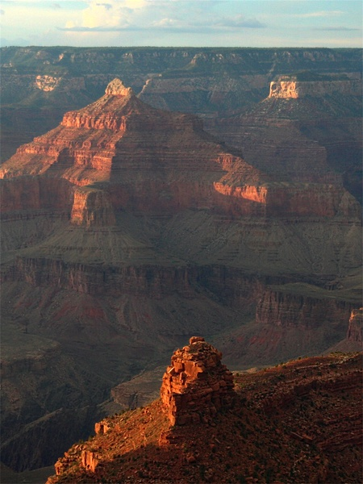

# Dehazing
This repository is used to publish the code, that usd in my image dehazing paper.  
  
The C++ algorithm can set the parameters below:
```
block_size: the kernel size of twice minimum filter, before get the dark channel.
morphology_transoform_kernel_size: the kernel size of Morphological Transformations
is_cirle_wrong_point: circle the wrong pixel of airlight  
```
Also, there is a python source code.
To calculate the dark channel, I used a erode calculation, same as the twice minimum filter.  
  

# Dependency
This algorithm is basesd on C++ and OpenCV.
Install OpenCV from source code, more informatino can be found 
[here](./others/install_opencv.md).
# Sample dataset
Download some sample datasets to test the algorithm.

[Benchmark images](http://kaiminghe.com/cvpr09/images.rar)
# Run the program
## C++
```
g++ dehaze.cpp dehaze.h `pkg-config --cflags --libs opencv4` -o dehaze
./dehaze input.bmp
```
## Python
```
python3 dehaze_python.py
```
# Paper
```
@article{2019TJSKE-D-19-00004,
  title={Research on Haze Removal for Autonomous Car},
  author={Zhi, Wang and Daishi, Watabe},
  journal={Transactions of Japan Society of Kansei Engineering},
  volume={18},
  number={6},
  pages={417-421},
  year={2019},
  doi={10.5057/jjske.TJSKE-D-19-00004}
}
```
